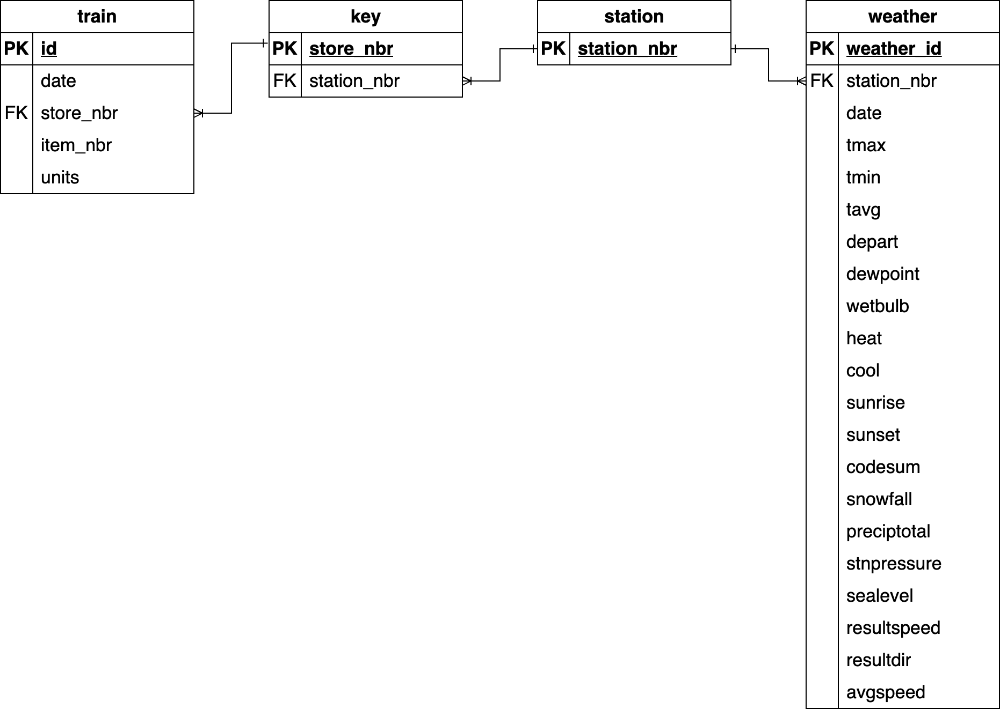

# Walmart Sales in Stormy Weather

**How do rain and snow events change what people buy, and which stores win or lose?**  
An end-to-end SQL analysis uncovering weather-driven demand patterns, panic buying behavior, and store resilience.

---

## Overview

Walmart, the world’s largest retailer by revenue, generated over $642B in global sales in 2024. With operations across diverse geographies and climates, external factors like weather can significantly impact consumer demand.

This project analyzes how **rain and snow events influence product demand and store performance**, with a focus on:

- Identifying **weather-sensitive products**
- Understanding **differences in demand during rain vs snow**
- Detecting **panic buying behavior before storms**
- Evaluating **store-level resilience vs vulnerability**

The goal is to generate insights that support **inventory planning, demand forecasting, and supply chain optimization**.

---

## Dataset

Source: [Kaggle - Walmart Recruiting: Sales in Stormy Weather](https://www.kaggle.com/c/walmart-recruiting-sales-in-stormy-weather/data)

The dataset consists of three main tables:

- **Train.csv**  
  Daily sales data for 111 products across 45 stores (2012–2014)

- **Weather.csv**  
  Daily weather metrics including precipitation and snowfall

- **Key.csv**  
  Mapping between stores and weather stations

---

## Data Pre-Processing

- Cleaned weather data:
  - Replaced `"M"` (missing values) → `NULL`
  - Replaced `"T"` (trace values) → `0`
- Created a standardized `clean_weather` table for analysis
- Joined sales data with weather data using store ↔ weather station mapping
- Defined storm conditions:
  - Stormy day: Rain > 1 inch OR Snow > 2 inches
  - Non-stormy day: All other days

### Entity-Relationship Diagram

  

## Full SQL implementation: [queries.sql](./queries.sql)
---

## Key Business Questions

1. **Which products are most sensitive to weather changes?**  
2. **Do certain products sell better in snow vs rain?**  
3. **Which items show signs of panic buying before storms?**  
4. **Which stores are most affected or resilient during storms**  

---

## Key Insights

### 1. Weather-Sensitive Products
- Certain items (e.g., item 93, 68, 48) show **>100% increase** during storms  
- Indicates strong dependency on weather-driven demand

### 2. Snow vs Rain Behavior
- Some products spike specifically during snow vs rain  
- Suggests **regional + seasonal stocking strategies**

### 3. Panic Buying Behavior
- Significant sales spikes observed **1 day before storms**  
- Confirms anticipatory consumer behavior

### 4. Store-Level Impact
- Some stores see **>15% drop in sales** during storms  
- Others see **>40% increase**, indicating resilience or demand surge

---

## Business Recommendations

- Increase stock for high-demand items **1–2 days before storms**
- Tailor inventory based on **rain vs snow patterns**
- Optimize logistics for **weather-sensitive stores**
- Replicate strategies from **high-performing resilient stores**

---

## Tech Stack

- SQL (CTEs, joins, aggregations, window logic)
- Data Cleaning & Transformation
- Business Analysis & KPI Design
