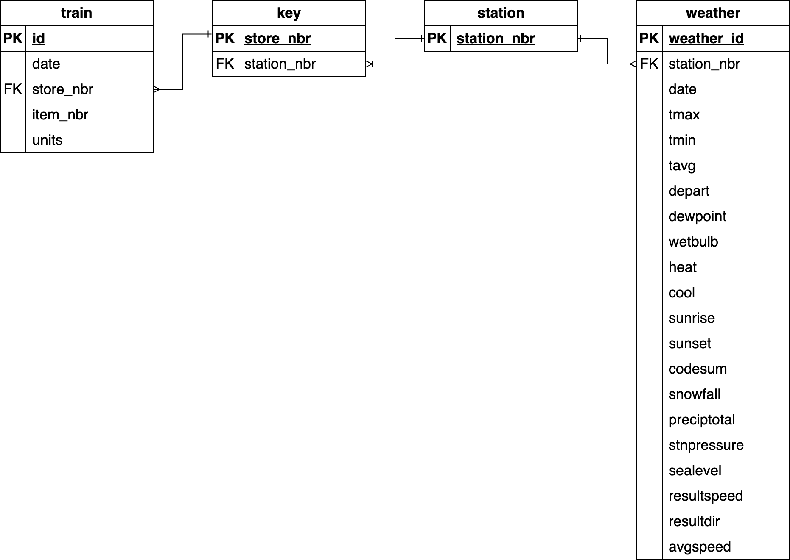

# Walmart Sales in Stormy Weather

How do rain and snow change what people buy, and which stores absorb the disruption best? A SQL analysis of daily sales across 45 Walmart stores against local weather records.

**Three findings drive the recommendations:**

1. Weather sensitivity is concentrated. Of the 14 items that clear the volume threshold, 4 more than doubled during storms while 6 actually declined. Treating weather as a general demand lift would be wrong for most of the catalog.
2. For several items the spike the day *before* a storm exceeds the spike on the storm day itself, which means storm-day restocking is already too late.
3. Snow and rain are close to categorical. A group of items sells almost exclusively in snow and records zero sales in rain, and another group does the reverse. They are not the same demand event.

**[SQL implementation](sql/walmart_stormy_sales_analysis.sql)**

---

## Problem

Walmart generated over $642B in global sales in 2024 across stores spanning very different climates. Weather is one of the few demand drivers that can be forecasted externally and can be acted on operationally through inventory management.

The question here is how product sales get affected, by how much, and when.

## Data

Source: [Walmart Recruiting: Sales in Stormy Weather](https://www.kaggle.com/c/walmart-recruiting-sales-in-stormy-weather/data) (Kaggle).

| Table | Contents |
|---|---|
| `train.csv` | Daily units sold, 111 products across 45 stores, 2012–2014 |
| `weather.csv` | Daily precipitation, snowfall and related metrics per weather station |
| `key.csv` | Store to weather station mapping |

**Product identities are anonymized in the source data as released by Walmart.** Items are referenced by index throughout. Category-level interpretation isn't possible, but we can analyze their demand patterns, magnitudes and timings.

### Preparation

- Weather codes cleaned: `"M"` (missing) to `NULL`, `"T"` (trace) to `0`
- Standardized `clean_weather` table built for analysis
- Sales joined to weather through the store-to-station mapping
- **Stormy day** defined as more than 1 inch of rain or more than 2 inches of snow. **Non-stormy day** is everything else.

## Method

Each business question resolves to the same shape: percentage change in daily average unit sales under one weather condition against the non-stormy baseline, grouped by item or by store.

| Question | Comparison |
|---|---|
| Which products are weather-sensitive? | Stormy vs non-stormy, by item |
| Do snow and rain differ? | Snow vs rain vs non-stormy, by item |
| Which items see anticipatory/panic buying? | Day before a storm vs non-stormy, by item |
| Which stores are affected or resilient? | Stormy vs non-stormy, by store |

### Scope

The catalog contains 111 items, but most sell in negligible volume. **An item is included only if its daily average sales reach at least 1 unit under at least one of the conditions being compared (snowy/rainy/non-stormy day).** That leaves 14 items for the stormy and pre-storm analyses and 21 for the snow-versus-rain comparison, which uses a wider set because an item can clear the bar on snow days alone.

The threshold keeps the percentage metric from being dominated by items that sell a handful of units a year. An item can enter the set on the strength of its stormy-day volume while its non-stormy baseline sits near zero, since qualifying under *either* condition is enough. Those are the items that produce the largest percentage figures, hence absolute units are reported alongside every percentage below.

Written in SQL using CTEs, joins, aggregations and window functions.

## Results

### 1. Weather sensitivity is concentrated in a few items

| Item | Stormy (units/day) | Non-stormy | Change |
|---|---|---|---|
| 93 | 4.52 | 0.62 | **+625%** |
| 68 | 9.95 | 4.07 | +144% |
| 25 | 8.39 | 3.50 | +140% |
| 48 | 3.75 | 1.81 | +108% |
| 16 | 9.59 | 5.40 | +78% |
| 36 | 2.64 | 2.01 | +32% |
| 37 | 3.47 | 3.00 | +16% |
| 44 | 14.53 | 13.87 | +5% |
| 5 | 18.79 | 20.37 | −8% |
| 9 | 19.26 | 22.07 | −13% |
| 41 | 0.90 | 1.12 | −19% |
| 45 | 14.04 | 24.29 | −42% |
| 43 | 0.52 | 1.13 | −54% |
| 6 | 0.34 | 1.00 | −66% |

Four items more than double. Six decline, two of them by more than half. Item 45 loses 10 units per day, which in absolute terms is the largest single movement in the table.

**The items that change the most are not the highest volume** Item 93's 625% sits on a baseline of 0.62 units per day, so the absolute gain is under 4 units. The highest-baseline items (44, 5, 9, 45, at 14–24 units per day) either barely move or fall. Items 25 and 16 are the ones that combine a meaningful baseline volume with a meaningful spike, and are good candidates for inventory optimization, although we need pricing info to ascertain revenue impact. Percentage change alone would have pointed at the wrong products.

### 2. Snow and rain are different demand events

| Item | Snow | Rain | Pattern |
|---|---|---|---|
| 39, 51, 50, 15, 83 | Large multiples of baseline | At or near −100% | Snow-only |
| 25, 16, 44 | +1,125%, +378%, +260% | +33%, +114%, +20% | Both, snow-dominant |
| 48, 36, 37, 23, 68 | −100% | +240%, +94%, +85%, +67%, +59% | Rain-only |
| 93 | −62% | +613% | Rain-driven |
| 6, 43 | −100% | −100% | Sells in neither |

The snow-only group records essentially zero sales in rain, and the rain-only group records zero in snow. This data clearly supports regional rather than uniform inventory strategy as several items have no reason to occupy shelf space in stores that don't get snow.

Absolute volumes matter here as they do above. Item 39's snow figure is a very large multiple of a baseline near 0.008 units per day, so the percentage is dramatic but the volume is not. Items 25, 16 and 44 are the ones with reasonable volumes.

### 3. Anticipatory buying arrives a day early

| Item | Day before storm | Non-stormy | Change | Storm-day change |
|---|---|---|---|---|
| 93 | 3.93 | 0.59 | +565% | +625% |
| 25 | 10.76 | 3.43 | **+213%** | +140% |
| 68 | 10.51 | 4.01 | +162% | +144% |
| 48 | 4.36 | 1.78 | **+145%** | +108% |
| 16 | 10.97 | 5.35 | **+105%** | +78% |
| 37 | 4.15 | 3.00 | +39% | +16% |
| 36 | 2.52 | 2.00 | +26% | +32% |

For items 25, 48, 16, 68 and 37, the day-before spike is *larger* than the storm-day spike. The operational consequence is that replenishing when the storm arrives misses most of the opportunity, and the stocking decision has to be made using the weather forecast, a few days earlier.

Item 93 is the exception, peaking on the day itself.

### 4. Store exposure varies by 75 percentage points

**Most disrupted**

| Store | Stormy | Non-stormy | Change |
|---|---|---|---|
| 45 | 14.25 | 21.36 | −33.3% |
| 6 | 96.33 | 121.23 | −20.5% |
| 1 | 33.00 | 40.55 | −18.6% |
| 37 | 95.00 | 102.01 | −6.9% |
| 4 | 128.60 | 136.79 | −6.0% |

**Most resilient**

| Store | Stormy | Non-stormy | Change |
|---|---|---|---|
| 22 | 126.09 | 88.51 | +42.5% |
| 39 | 21.30 | 15.13 | +40.8% |
| 8 | 68.91 | 49.14 | +40.2% |
| 23 | 94.60 | 68.21 | +38.7% |
| 26 | 126.40 | 95.92 | +31.8% |

Stores 22, 39, 8 and 23 gain 38% or more during storms while store 45 loses a third. That spread across the same weather definition points at something store-level: inventory, neighborhood/location, or how often severe weather patterns occur.

## Recommendations

**Stock one to two days ahead of forecast, not on the day.** For items 25, 48, 16, 68 and 37 the pre-storm surge exceeds the storm-day surge, so the replenishment trigger should be the forecast rather than the event.

**Prioritize items 25 and 16 for rain, and items 25, 16 and 44 for snow.** These combine real baseline volume with large spikes, which will drive revenue. Items 93, 68 and 48 also respond strongly but from small bases, so they matter for availability and customer experience more than for volume.

**Regionalize the snow-specific set of items.** Items 39, 51, 50, 15 and 83 sell in snow and essentially not at all in rain. Stocking them in locations that don't get snow is dead inventory.

**Reduce inventory for items that decline.** Items 45, 43 and 6 fall by 42% to 66% during storms. Item 45 in particular loses 10 units per day, so pre-storm reduction is as much of an opportunity as the increases.

**Investigate stores 22, 39, 8 and 23 before optimizing stores 45, 6 and 1.** The resilient stores gain sales and understanding why would help improve the disrupted stores quickly.

## Limitations

**A uniform storm threshold across climates.** Two inches of snow is a routine Tuesday in the upper Midwest and a shutdown in the Southeast. Applying one definition nationally mixes ordinary weather with genuine disruption.

**Store and weather effects are confounded.** A store that gains during storms may be in a region where storm days cluster in a high-demand season, or may simply see few storm days at all. Storm-day counts per store would separate this and are not controlled for here.

**No seasonality control.** Snow days are winter days, and winter has its own demand profile independent of weather. Some of the snow-item effect is likely seasonal rather than weather-driven.

**Correlation only.** Nothing here isolates weather as a cause, and no significance testing was performed on any of the differences reported.
